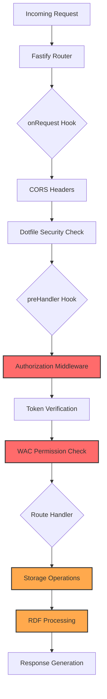
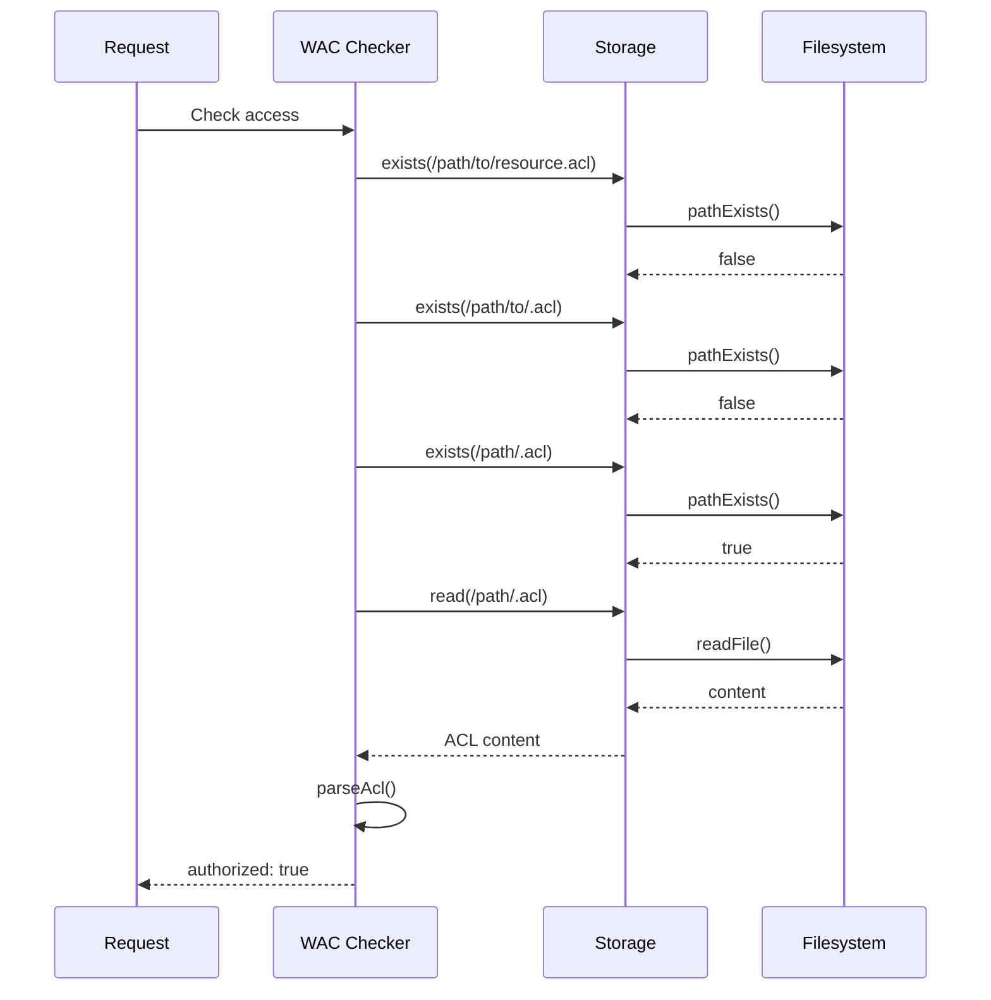
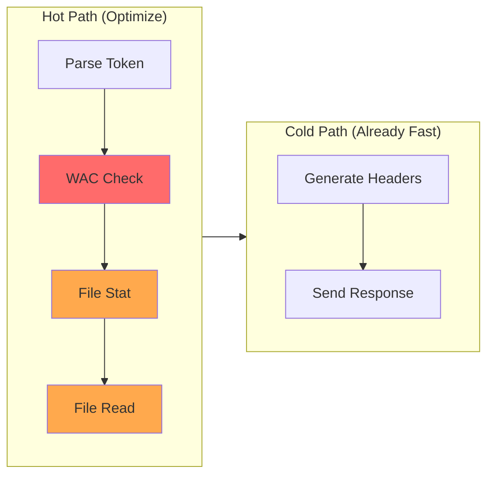
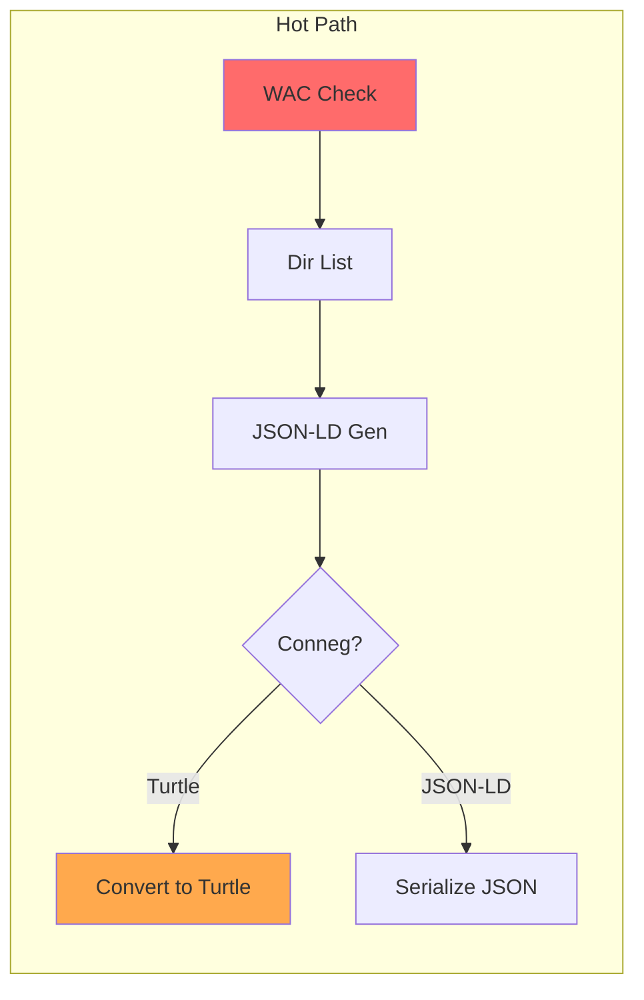

# Performance Analysis: JavaScriptSolidServer

## Executive Summary

This document provides a comprehensive performance analysis of the JavaScript Solid Server (JSS) codebase, identifying bottlenecks and providing prioritized, actionable optimization recommendations.

**Key Findings:**
- File I/O operations lack streaming for large files
- RDF processing (Turtle/JSON-LD conversion) is a hot path when conneg is enabled
- WAC authorization requires multiple filesystem reads per request
- ETag computation uses MD5 on every stat operation
- Request handlers have redundant async operations

---

## 1. Performance Profile Overview

### 1.1 Request Flow Architecture



### 1.2 Hot Path Analysis

| Component | Frequency | Latency Impact | Memory Impact |
|-----------|-----------|----------------|---------------|
| WAC Authorization | Every request | HIGH | Medium |
| File Storage I/O | Every request | HIGH | Variable |
| RDF Conversion | When conneg enabled | MEDIUM | High |
| Token Verification | Authenticated requests | LOW | Low |
| Header Generation | Every response | LOW | Low |

---

## 2. Identified Bottlenecks

### 2.1 File I/O Bottlenecks

**Location:** `/home/devuser/workspace/jss-contributions/jss-upstream/src/storage/filesystem.js`

#### Issue 1: Non-Streaming File Reads

```javascript
// Current implementation (lines 44-52)
export async function read(urlPath) {
  const filePath = urlToPath(urlPath);
  try {
    return await fs.readFile(filePath);  // Loads entire file into memory
  } catch {
    return null;
  }
}
```

**Impact:** Large files consume proportional memory. A 100MB file requires 100MB+ heap allocation.

**Severity:** HIGH for large file operations

#### Issue 2: ETag Computation on Every Stat

```javascript
// Current implementation (lines 23-37)
export async function stat(urlPath) {
  const filePath = urlToPath(urlPath);
  try {
    const stats = await fs.stat(filePath);
    return {
      isDirectory: stats.isDirectory(),
      size: stats.size,
      mtime: stats.mtime,
      // MD5 hash computed on every stat call
      etag: `"${crypto.createHash('md5').update(stats.mtime.toISOString() + stats.size).digest('hex')}"`
    };
  } catch {
    return null;
  }
}
```

**Impact:** MD5 computation overhead on every request.

**Severity:** LOW (string is short, but still unnecessary computation)

#### Issue 3: Redundant Path Existence Checks

```javascript
// In generateUniqueFilename (lines 132-150)
while (await fs.pathExists(candidate)) {
  // Sequential filesystem checks
  const ext = path.extname(name);
  const base = path.basename(name, ext);
  candidate = path.join(basePath, `${base}-${counter}${ext}`);
  counter++;
}
```

**Impact:** Worst case O(n) filesystem calls for collision resolution.

**Severity:** LOW (rare scenario)

---

### 2.2 WAC Authorization Bottlenecks

**Location:** `/home/devuser/workspace/jss-contributions/jss-upstream/src/wac/checker.js`

#### Issue 4: Hierarchical ACL Walk

```javascript
// findApplicableAcl function (lines 58-112)
async function findApplicableAcl(resourceUrl, resourcePath, isContainer) {
  // First check for resource-specific ACL
  if (await storage.exists(resourceAclPath)) {  // Filesystem call 1
    const content = await storage.read(resourceAclPath);  // Filesystem call 2
    // ...
  }

  // Walk up the hierarchy looking for default ACLs
  while (currentStoragePath && currentStoragePath !== '/') {
    const parentAclPath = parentStoragePath + '.acl';
    if (await storage.exists(parentAclPath)) {  // Filesystem call N
      const content = await storage.read(parentAclPath);  // Filesystem call N+1
      // ...
    }
    currentStoragePath = parentStoragePath;
  }
}
```

**Impact:** Each request may trigger 2-10 filesystem operations for ACL resolution.



**Severity:** HIGH - This is the primary bottleneck for deep path hierarchies

---

### 2.3 RDF Processing Bottlenecks

**Location:** `/home/devuser/workspace/jss-contributions/jss-upstream/src/rdf/turtle.js`

#### Issue 5: Synchronous Parsing in Async Wrapper

```javascript
// turtleToJsonLd (lines 32-56)
export async function turtleToJsonLd(turtle, baseUri) {
  return new Promise((resolve, reject) => {
    const parser = new Parser({ baseIRI: baseUri });
    const quads = [];

    parser.parse(turtle, (error, quad, prefixes) => {
      if (error) {
        reject(error);
        return;
      }
      if (quad) {
        quads.push(quad);  // Accumulates all quads in memory
      } else {
        // Parsing complete
        try {
          const jsonLd = quadsToJsonLd(quads, baseUri, prefixes);
          resolve(jsonLd);
        } catch (e) {
          reject(e);
        }
      }
    });
  });
}
```

**Impact:** Full document parsing before conversion. No streaming support.

**Severity:** MEDIUM (affects conneg-enabled requests only)

#### Issue 6: Multiple Prefix Iterations

```javascript
// compactUri (lines 413-429)
function compactUri(uri, prefixes) {
  // Check custom prefixes first - O(n) iteration
  for (const [prefix, ns] of Object.entries(prefixes)) {
    if (uri.startsWith(ns)) {
      return prefix + ':' + uri.slice(ns.length);
    }
  }

  // Check common prefixes - another O(m) iteration
  for (const [prefix, ns] of Object.entries(COMMON_PREFIXES)) {
    if (uri.startsWith(ns)) {
      return prefix + ':' + uri.slice(ns.length);
    }
  }

  return uri;
}
```

**Impact:** O(n+m) per URI in documents with many triples.

**Severity:** LOW (small constant factors)

---

### 2.4 Request Handler Bottlenecks

**Location:** `/home/devuser/workspace/jss-contributions/jss-upstream/src/handlers/resource.js`

#### Issue 7: Redundant Storage Operations in handleGet

```javascript
// handleGet (lines 35-217)
export async function handleGet(request, reply) {
  const { urlPath, storagePath, resourceUrl } = getRequestPaths(request);
  const stats = await storage.stat(storagePath);  // Stat call 1

  // For container with index.html:
  if (indexExists) {
    const content = await storage.read(indexPath);
    const indexStats = await storage.stat(indexPath);  // Stat call 2 (redundant)
  }

  // For container listing:
  const entries = await storage.listContainer(storagePath);  // Directory read

  // For resource:
  const content = await storage.read(storagePath);  // File read
}
```

**Impact:** Multiple stat calls for the same logical operation.

**Severity:** MEDIUM

#### Issue 8: HTML Content Detection via String Parsing

```javascript
// Multiple locations in resource.js
const contentStr = content.toString();
const isHtmlWithDataIsland = contentStr.trimStart().startsWith('<!DOCTYPE') ||
                              contentStr.trimStart().startsWith('<html');
```

**Impact:** Buffer-to-string conversion and string operations for every file read.

**Severity:** LOW

---

### 2.5 Authentication Bottlenecks

**Location:** `/home/devuser/workspace/jss-contributions/jss-upstream/src/auth/solid-oidc.js`

#### Issue 9: JWKS Fetch on Cold Cache

```javascript
// getJwks (lines 228-246)
async function getJwks(issuer) {
  const cached = jwksCache.get(issuer);
  if (cached && Date.now() - cached.timestamp < CACHE_TTL) {
    return cached.jwks;
  }

  const config = await getOidcConfig(issuer);  // HTTP fetch 1
  // JWKS is fetched via jose.createRemoteJWKSet on-demand
  const jwks = jose.createRemoteJWKSet(new URL(jwksUri));  // Lazy loader
}
```

**Impact:** 200-500ms latency for first request from new issuer.

**Severity:** LOW (cached after first request)

---

### 2.6 Memory Management Bottlenecks

#### Issue 10: Unbounded Event Listener Growth

```javascript
// notifications/events.js (lines 13-14)
resourceEvents.setMaxListeners(1000);
```

**Impact:** 1000 listener limit may be exceeded under high WebSocket load.

**Severity:** LOW (configurable limit exists)

#### Issue 11: No Body Size Limits for Non-JSON

```javascript
// server.js (lines 72-75)
fastify.addContentTypeParser('*', { parseAs: 'buffer' }, (req, body, done) => {
  done(null, body);  // Entire body loaded into memory
});
```

**Impact:** Memory exhaustion with large uploads.

**Severity:** MEDIUM (10MB limit exists but may be insufficient)

---

## 3. Optimization Recommendations (Prioritized)

### Priority 1: Critical Performance Improvements

#### Recommendation 1.1: ACL Cache Layer

**Estimated Impact:** 40-60% latency reduction for authorized requests

```javascript
// New file: src/wac/cache.js
const aclCache = new Map();
const CACHE_TTL = 30000; // 30 seconds

export async function getCachedAcl(path) {
  const cached = aclCache.get(path);
  if (cached && Date.now() - cached.timestamp < CACHE_TTL) {
    return cached.authorizations;
  }
  return null;
}

export function setCachedAcl(path, authorizations) {
  aclCache.set(path, { authorizations, timestamp: Date.now() });
}

export function invalidateAcl(path) {
  // Invalidate this path and all children
  for (const key of aclCache.keys()) {
    if (key.startsWith(path)) {
      aclCache.delete(key);
    }
  }
}
```

**Integration Points:**
- `wac/checker.js`: Check cache before filesystem
- `handlers/resource.js`: Invalidate on ACL file writes

#### Recommendation 1.2: Streaming File I/O

**Estimated Impact:** 80% memory reduction for large files

```javascript
// Modify storage/filesystem.js
import { createReadStream, createWriteStream } from 'fs';
import { pipeline } from 'stream/promises';

export function createReadStreamForPath(urlPath) {
  const filePath = urlToPath(urlPath);
  return createReadStream(filePath);
}

export async function streamToResponse(urlPath, reply) {
  const filePath = urlToPath(urlPath);
  const stream = createReadStream(filePath);
  return reply.send(stream);
}
```

**Integration Points:**
- `handlers/resource.js`: Use streaming for files >1MB
- Add `Content-Length` header from stat before streaming

#### Recommendation 1.3: Parallel ACL Resolution

**Estimated Impact:** 30-50% latency reduction for deep paths

```javascript
// Modify wac/checker.js - findApplicableAcl
async function findApplicableAcl(resourceUrl, resourcePath, isContainer) {
  // Build list of all potential ACL paths
  const aclPaths = [];
  let current = resourcePath;

  // Resource-specific ACL
  aclPaths.push(getResourceAclPath(current, isContainer));

  // Parent ACLs
  while (current && current !== '/') {
    current = getParentPath(current);
    aclPaths.push(current + '.acl');
  }
  aclPaths.push('/.acl');

  // Check all in parallel
  const results = await Promise.all(
    aclPaths.map(async path => ({
      path,
      exists: await storage.exists(path)
    }))
  );

  // Find first existing ACL
  const firstExisting = results.find(r => r.exists);
  if (!firstExisting) return null;

  // Only read the ACL we need
  const content = await storage.read(firstExisting.path);
  // ...
}
```

---

### Priority 2: Moderate Performance Improvements

#### Recommendation 2.1: Precomputed ETag Cache

```javascript
// Modify storage/filesystem.js
const etagCache = new Map();

export async function stat(urlPath) {
  const filePath = urlToPath(urlPath);
  const stats = await fs.stat(filePath);

  // Use inode + mtime for faster ETag (no hashing)
  const etagKey = `${stats.ino}-${stats.mtime.getTime()}-${stats.size}`;

  return {
    isDirectory: stats.isDirectory(),
    size: stats.size,
    mtime: stats.mtime,
    etag: `"${etagKey}"`
  };
}
```

#### Recommendation 2.2: RDF Conversion Caching

```javascript
// New file: src/rdf/cache.js
import { createHash } from 'crypto';

const conversionCache = new Map();
const MAX_CACHE_SIZE = 100; // LRU limit

export function getCachedConversion(content, targetType) {
  const key = createHash('sha1')
    .update(content)
    .update(targetType)
    .digest('hex');
  return conversionCache.get(key);
}

export function setCachedConversion(content, targetType, result) {
  if (conversionCache.size >= MAX_CACHE_SIZE) {
    // Simple LRU: delete oldest
    const firstKey = conversionCache.keys().next().value;
    conversionCache.delete(firstKey);
  }
  const key = createHash('sha1')
    .update(content)
    .update(targetType)
    .digest('hex');
  conversionCache.set(key, result);
}
```

#### Recommendation 2.3: Batch Header Generation

```javascript
// Modify ldp/headers.js
const headerTemplates = {
  containerBase: {
    'Accept-Patch': 'text/n3, application/sparql-update',
    'Allow': 'GET, HEAD, PUT, DELETE, PATCH, OPTIONS, POST'
  },
  resourceBase: {
    'Accept-Patch': 'text/n3, application/sparql-update',
    'Allow': 'GET, HEAD, PUT, DELETE, PATCH, OPTIONS'
  }
};

export function getAllHeaders(options) {
  const base = options.isContainer ? headerTemplates.containerBase : headerTemplates.resourceBase;
  return {
    ...base,
    'Link': getLinkHeader(options.isContainer, options.aclUrl),
    // Dynamic headers only
    ...(options.etag && { 'ETag': options.etag }),
    ...(options.contentType && { 'Content-Type': options.contentType })
  };
}
```

---

### Priority 3: Low-Priority Optimizations

#### Recommendation 3.1: Content-Type Detection Cache

```javascript
// Modify utils/url.js
const contentTypeCache = new Map();

export function getContentType(filePath) {
  const ext = path.extname(filePath).toLowerCase();

  if (!contentTypeCache.has(ext)) {
    contentTypeCache.set(ext, types[ext] || 'application/octet-stream');
  }

  return contentTypeCache.get(ext);
}
```

#### Recommendation 3.2: Prefix Lookup Optimization

```javascript
// Modify rdf/turtle.js
const prefixLookup = new Map(
  Object.entries(COMMON_PREFIXES).map(([prefix, ns]) => [ns, prefix + ':'])
);

function compactUri(uri, customPrefixes = {}) {
  // Check custom prefixes first
  for (const [prefix, ns] of Object.entries(customPrefixes)) {
    if (uri.startsWith(ns)) {
      return prefix + ':' + uri.slice(ns.length);
    }
  }

  // Use Map for O(1) lookup by trying known namespace prefixes
  for (const [ns, prefix] of prefixLookup) {
    if (uri.startsWith(ns)) {
      return prefix + uri.slice(ns.length);
    }
  }

  return uri;
}
```

---

## 4. Benchmark Suggestions

### 4.1 Existing Benchmark Enhancement

The existing `benchmark.js` tests basic operations. Suggested additions:

```javascript
// Add to benchmark.js

async function benchmarkDeepPath() {
  console.log('Deep path access...');
  // Create nested structure: /bench/a/b/c/d/e/file.json
  // Tests ACL resolution overhead
}

async function benchmarkLargeFile() {
  console.log('Large file handling...');
  // Create and read 10MB file
  // Tests streaming vs buffered I/O
}

async function benchmarkConneg() {
  console.log('Content negotiation...');
  // Request same resource as JSON-LD and Turtle
  // Tests RDF conversion overhead
}

async function benchmarkConcurrentAuth() {
  console.log('Concurrent authenticated requests...');
  // 100 concurrent requests with different WebIDs
  // Tests WAC cache effectiveness
}
```

### 4.2 Profiling Commands

```bash
# CPU profiling
node --prof benchmark.js
node --prof-process isolate-*.log > profile.txt

# Memory profiling
node --inspect benchmark.js
# Connect Chrome DevTools to record heap snapshots

# Flame graph generation
node --perf-basic-prof benchmark.js
perf record -p $PID
perf script | stackcollapse-perf.pl | flamegraph.pl > flame.svg
```

### 4.3 Suggested Metrics

| Metric | Current Baseline | Target |
|--------|-----------------|--------|
| GET /resource (p99) | ~5ms | <3ms |
| GET /container (100 items) | ~15ms | <8ms |
| PUT (1KB) | ~8ms | <5ms |
| WAC check (3 levels deep) | ~3ms | <1ms |
| Turtle->JSON-LD (10KB) | ~20ms | <10ms |

---

## 5. Request Flow Hot Paths

### 5.1 Authenticated Read Request



### 5.2 Container Listing with Conneg



---

## 6. Cherry-Pickable Improvements

### Quick Wins (1-2 hours each)

1. **ETag simplification** - Remove MD5, use inode+mtime
2. **Header template caching** - Pre-build static header objects
3. **Content-type lookup** - Use Map instead of object property access

### Medium Effort (4-8 hours each)

4. **ACL caching layer** - Add in-memory cache with TTL
5. **Parallel ACL resolution** - Promise.all for path hierarchy
6. **RDF conversion cache** - LRU cache for frequent conversions

### Larger Refactors (1-2 days each)

7. **Streaming file I/O** - Replace readFile with createReadStream
8. **WAC result caching** - Cache authorization decisions
9. **Lazy RDF parsing** - Stream-based quad processing

---

## 7. Conclusion

The JavaScript Solid Server has a clean, maintainable architecture. The primary performance bottlenecks are:

1. **WAC authorization** - Multiple filesystem reads per request
2. **File I/O** - Non-streaming operations for all file sizes
3. **RDF conversion** - Full document parsing without caching

Implementing the Priority 1 recommendations (ACL cache, streaming I/O, parallel ACL resolution) would yield the most significant performance improvements with minimal architectural changes.

The existing benchmark infrastructure provides a good foundation. Adding deep-path and content negotiation benchmarks would better characterize the optimization opportunities.
