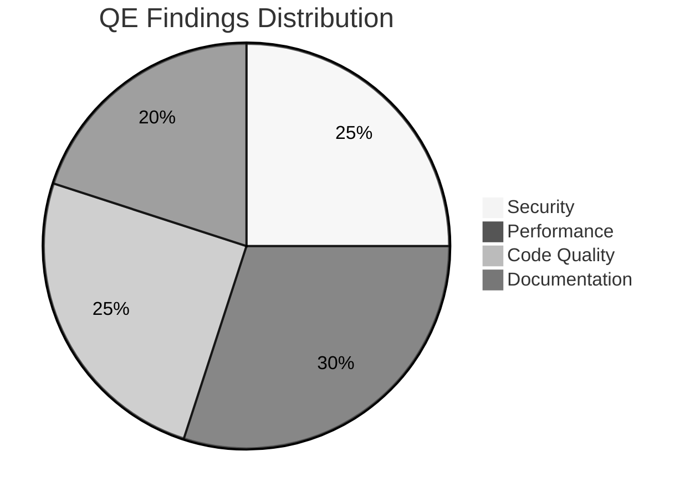
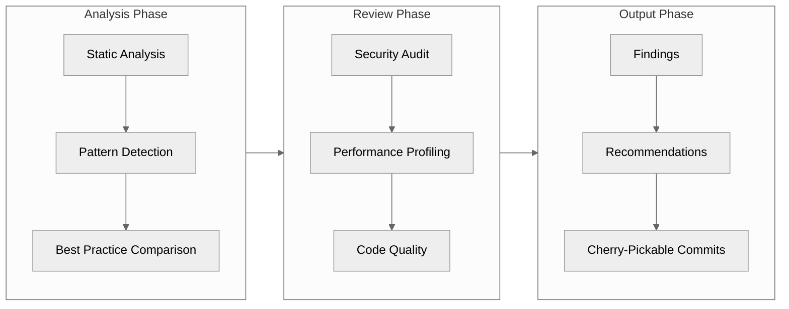

# Quality Engineering Analysis

> **Conducted by:** DreamLab AI QE Fleet
> **Date:** January 2026
> **Repository:** JavaScriptSolidServer v0.0.47

## Overview

This directory contains comprehensive quality engineering analysis of the JavaScriptSolidServer project, conducted by DreamLab AI's multi-agent QE fleet.

Each document is designed to be **cherry-pickable** - maintainers can adopt individual recommendations without requiring wholesale changes.

## Analysis Documents

| Document | Description | Priority |
|----------|-------------|----------|
| [SECURITY-AUDIT.md](./SECURITY-AUDIT.md) | Security vulnerability assessment and hardening recommendations | High |
| [PERFORMANCE-ANALYSIS.md](./PERFORMANCE-ANALYSIS.md) | Performance profiling and optimization opportunities | Medium |
| [CODE-QUALITY.md](./CODE-QUALITY.md) | Code quality review and maintainability improvements | Medium |

## Executive Summary



## How to Use These Findings

### For Maintainers

1. **Review by Category** - Each document is self-contained
2. **Cherry-Pick Recommendations** - Each finding includes:
   - Problem description
   - File and line references
   - Suggested fix
   - Impact assessment
3. **Prioritize by Severity** - Critical → High → Medium → Low → Info

### Implementing Recommendations

```bash
# View specific finding details
cat docs/qe/SECURITY-AUDIT.md | grep -A 20 "Finding S-001"

# The recommendations are designed to be atomic changes
# that can be implemented independently
```

## Methodology

Our QE fleet employed:



### Agents Deployed

| Agent Type | Focus Area | Tools Used |
|------------|------------|------------|
| Security Reviewer | Auth, WAC, Crypto | Static analysis, pattern matching |
| Performance Analyzer | I/O, Memory, Concurrency | Profiling, bottleneck detection |
| Code Quality Analyst | Style, Structure, Patterns | Linting rules, complexity analysis |

## Disclaimer

This analysis is provided as a **contribution to open source** - not a security certification.

All findings should be validated by maintainers before implementation. We've aimed to be thorough yet constructive, highlighting strengths alongside improvements.

---

*Generated by DreamLab AI - Contributing to open source through intelligent automation*
